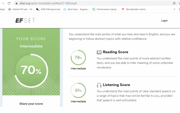

# Lioudmila Krylova  

### Contacts
**Location**: Vilnius, Lithuania  

**Phone**: +370 60925476  

**Email**: une_dina@mail.ru  

**GitHub**: klvklv  

 [LinkedIn](https://www.linkedin.com/feed/?trk=onboarding-landing/)  

---
### About Me
I'm scared to death and just trying to survive. If I fail to master the frontend, I'll have to work as a cleaner. This fact  motivate me strong, but it does not add confidence in luck. I understand that I have to write in this section something correct from the point of view of the HR. But I write the truth. Nobody will read it anyway.

---
### Skills
* HTML
* CSS/SASS
* JavaScript (Basic)
* Github  
---
## Code Example
	function numberOfPairs(gloves)
	{
	   let arr = gloves.slice();
	   arr.sort();
	   let count = 0;
	   for(let i = 0; i < arr.length-1; i++) {
		if(arr[i] == arr[i+1]) {
		   count++;
		   i++;
		   }
		}
	   return count;
	}
---
## Work experience
[CV](https://klvklv.github.io/rsschool-cv/)
[Portfolio](https://rolling-scopes-school.github.io/klvklv-JSFEPRESCHOOL/Portfolio/)
[Eco sounds](https://rolling-scopes-school.github.io/klvklv-JSFEPRESCHOOL/eco-sounds/)
[Image gallery](https://rolling-scopes-school.github.io/klvklv-JSFEPRESCHOOL/image-galery/)
[Memory game](https://rolling-scopes-school.github.io/klvklv-JSFEPRESCHOOL/memory-game/)  

---
## Education
* The Moscow school of social and economic science
(MA Sociology)
* Post-graduate of the research institute of the Ministry of Economy of Belarus 
* Institute of Modern Knowledge named after A.M. Shirokov 
(Finance)

---
### Courses:
+ HTML and CSS (HTML Academy, W3School - in progress)
+ JavaScript Manual on learnjavascript.ru (in progress)
+ Testing software (SkillUP)
+ Basic of WEB (html, css, SQL) (SkillUP)  

---
### Languages:
*English* - Intermediate (B1 express test www.efset.org)  

 

*Russian* - Native  

*French* - Pre Intermediate (A2)
